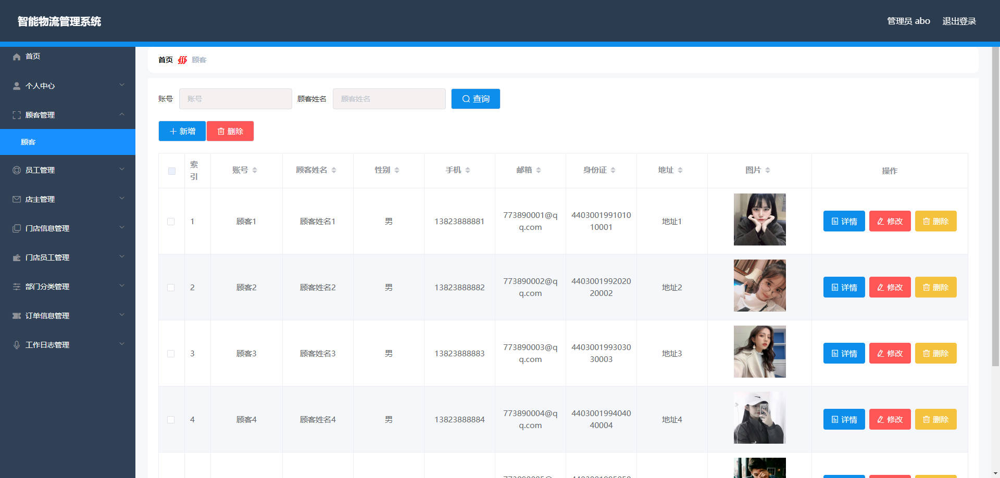
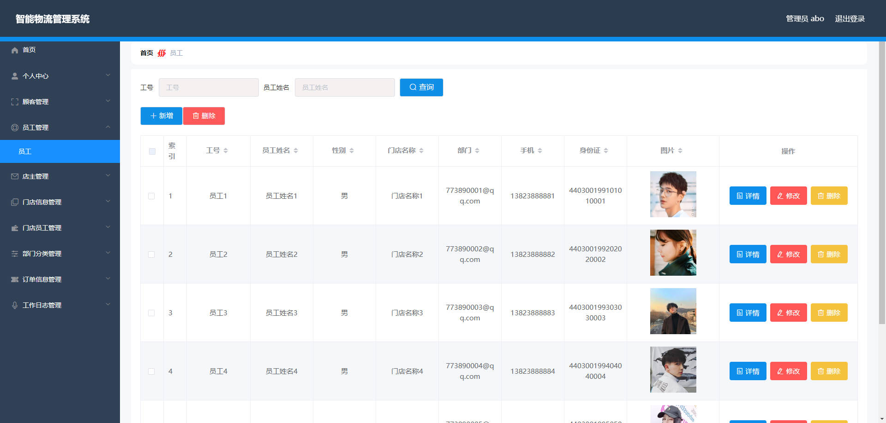
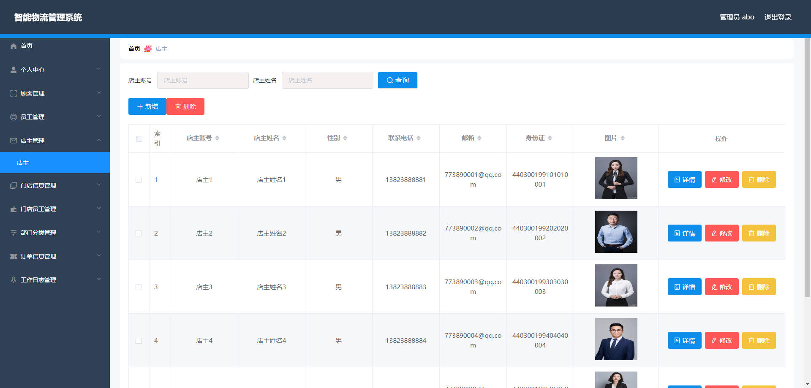
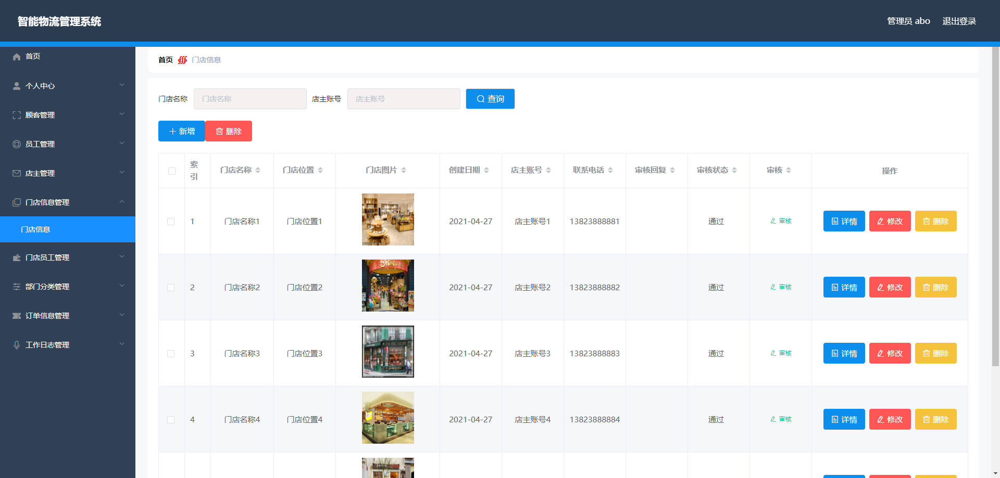
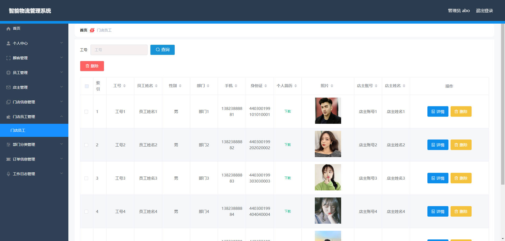
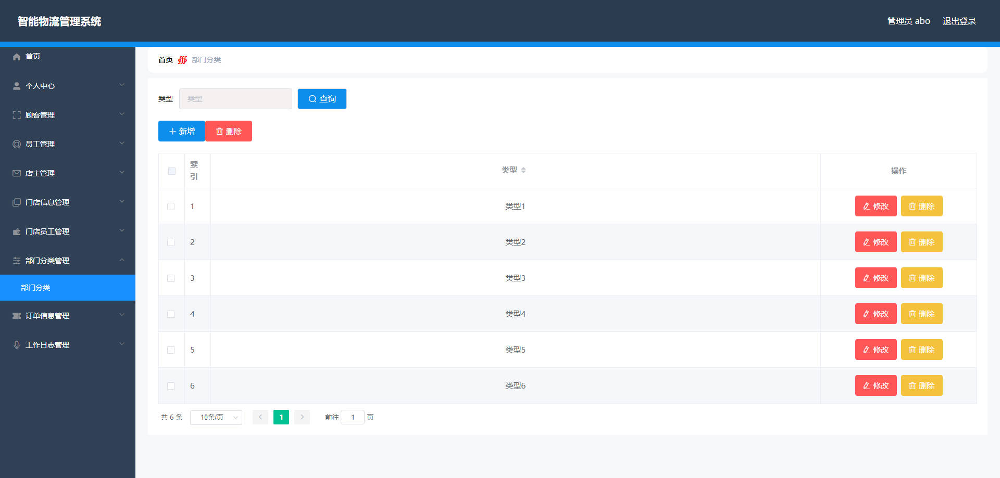
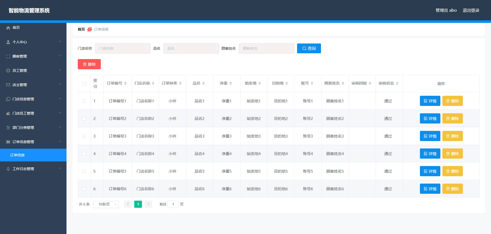
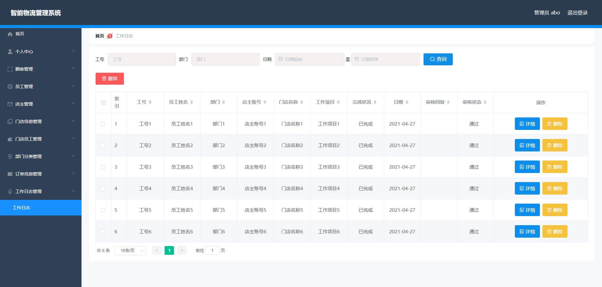
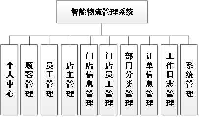
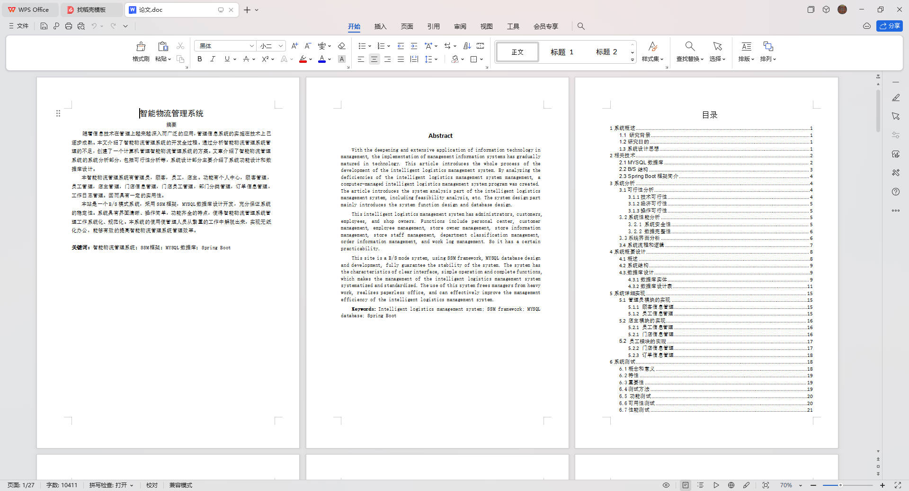

# 基于Springboot的智能物流管理系统

## Springboot-0074


## 技术栈

Springboot mybatisplus vue mysql maven


## 数据库表(11张)


## 功能介绍

```properties
本智能物流管理系统有管理员，顾客，员工，店主。功能有个人中心，顾客管理，员工管理，店主管理，门店信息管理，门店员工管理，部门分类管理，订单信息管理，工作日志管理

```


## 图片

### 前台

### 后台












## 访问路径

### 前台

```properties

```

### 后台

```properties
http://localhost:8080/springboot142f7/admin/dist/index.html#/login

账号 abo
密码 abo
```


## 功能图




## 文档目录




## 打赏或交流


